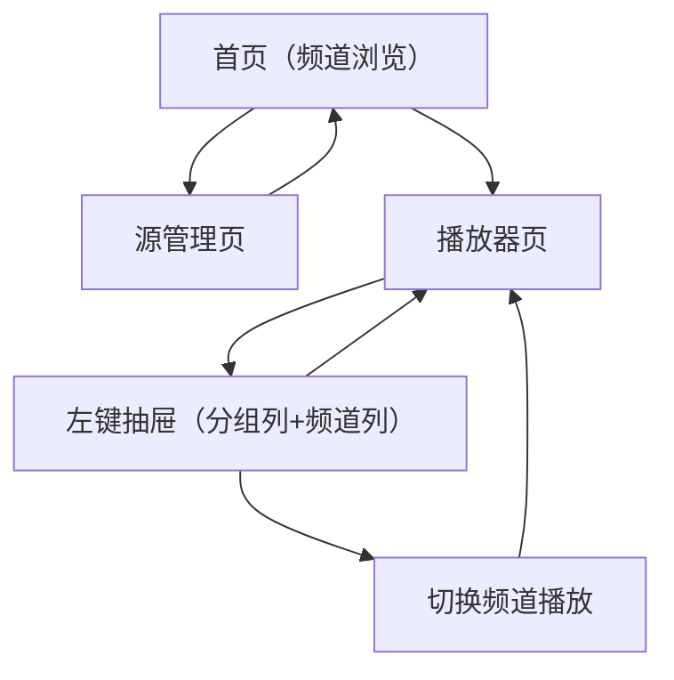

## 1. Product Overview
一款深色风格的 Android TV IPTV 播放器，支持导入/加载 m3u 等直播源并播放频道视频。
面向电视遥控器操作场景，提供“分组-频道-播放”的快速切换体验。

## 2. Core Features

### 2.1 Feature Module
本产品最小可用版本包含以下页面：
1. **首页（频道浏览）**：直播源导入/选择、分组列表、频道列表、进入播放。
2. **播放器页**：视频播放、左键抽屉（分组列+频道列）、频道切换、台标展示。
3. **源管理页**：添加/编辑/删除直播源、手动刷新解析。

### 2.3 Page Details
| Page Name | Module Name | Feature description |
|-----------|-------------|---------------------|
| 首页（频道浏览） | 直播源入口 | 导入 m3u（本地文件/URL 二选一实现即可），选择当前使用的直播源，触发解析并展示结果。 |
| 首页（频道浏览） | 分组与频道浏览 | 展示分组列表与对应频道列表；支持遥控器上下移动焦点、点击频道进入播放。 |
| 首页（频道浏览） | 最近播放（可选） | 展示最近播放频道，支持一键继续播放（不影响核心流程）。 |
| 播放器页 | 播放控制 | 播放当前频道流；在界面上显示频道名等基础信息（必要时自动隐藏）。 |
| 播放器页 | 左键抽屉 | 按遥控器左键打开抽屉；抽屉从左到右为“分组列”和“频道列”；抽屉打开后焦点进入抽屉并可关闭回到视频区域。 |
| 播放器页 | 频道列台标 | 在频道项展示台标（logo）；无台标时显示占位图/首字母占位；台标加载失败需降级不影响切台。 |
| 播放器页 | 快速切台 | 在抽屉内选择频道后立即切换播放；保留当前分组选择状态以便连续切换。 |
| 源管理页 | 源列表管理 | 展示已添加源；支持新增、编辑名称与地址、删除；支持手动刷新（重新拉取并解析）。 |

## 3. Core Process
- 普通用户流程：打开应用 → 在首页导入/选择直播源 → 解析后浏览分组与频道 → 选择频道进入播放器 → 播放器中按左键打开抽屉 → 在分组列切换分组/在频道列选择频道 → 立即切台播放 → 关闭抽屉回到视频。

