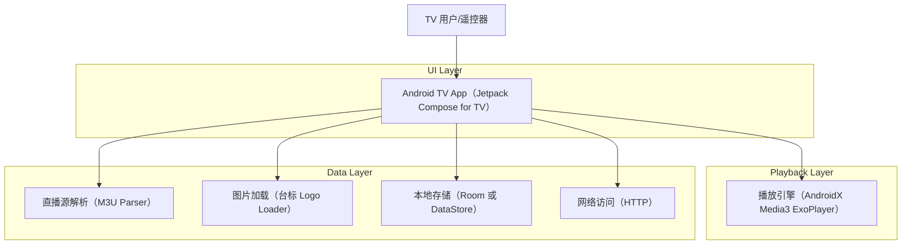
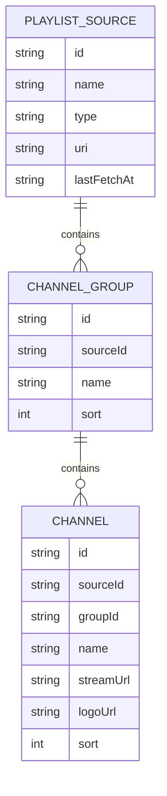

## 1.Architecture design


## 2.Technology Description
- 客户端：Kotlin + Jetpack Compose for TV（Material 3 for TV）
- 播放：AndroidX Media3（ExoPlayer）
- 网络：OkHttp（或系统 HttpUrlConnection，二选一即可）
- 解析：kotlinx.serialization（如需要）+ 自定义 M3U 文本解析
- 图片：Coil（加载频道台标 URL/本地缓存）
- 本地存储：DataStore（保存当前源/最近播放）+ Room（可选，用于结构化缓存分组/频道）
- 后端：None

## 3.Route definitions
| Route | Purpose |
|-------|---------|
| /browse | 首页（频道浏览）：选择/导入源，浏览分组与频道，进入播放 |
| /player | 播放器页：播放视频，左键抽屉切台，展示台标 |
| /sources | 源管理页：新增/编辑/删除源，手动刷新 |

## 6.Data model(if applicable)
### 6.1 Data model definition


### 6.2 Data Definition Language
Playlist Source（playlist_source）
```
CREATE TABLE playlist_source (
  id TEXT PRIMARY KEY,
  name TEXT NOT NULL,
  type TEXT NOT NULL,
  uri TEXT NOT NULL,
  last_fetch_at TEXT
);

CREATE TABLE channel_group (
  id TEXT PRIMARY KEY,
  source_id TEXT NOT NULL,
  name TEXT NOT NULL,
  sort INTEGER DEFAULT 0
);

CREATE TABLE channel (
  id TEXT PRIMARY KEY,
  source_id TEXT NOT NULL,
  group_id TEXT NOT NULL,
  name TEXT NOT NULL,
  stream_url TEXT NOT NULL,
  logo_url TEXT,
  sort INTEGER DEFAULT 0
);

CREATE INDEX idx_group_source ON channel_group(source_id, sort);
CREATE INDEX idx_channel_group ON channel(group_id, sort);
```
