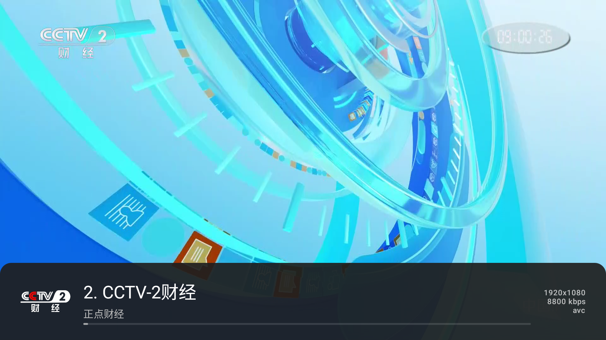
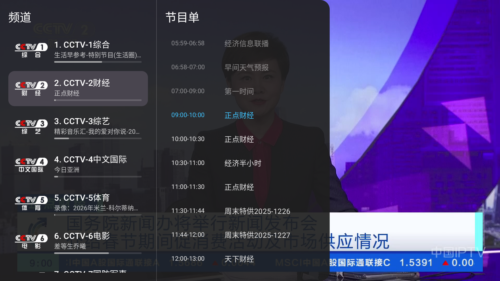
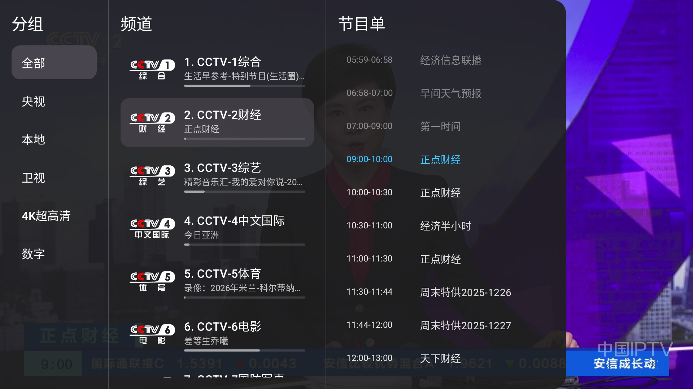
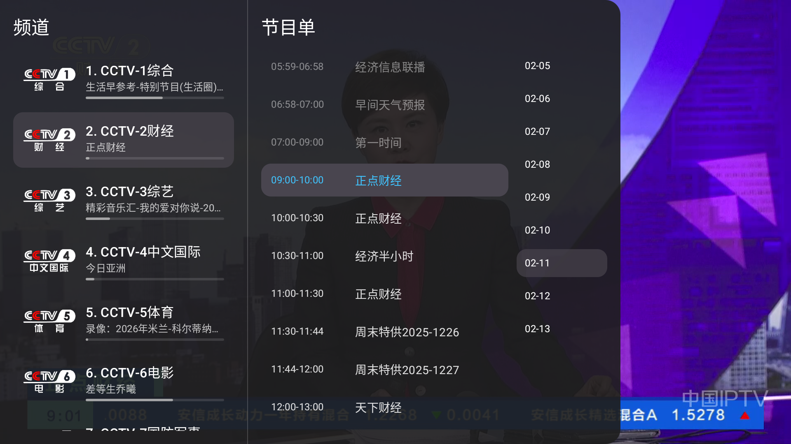
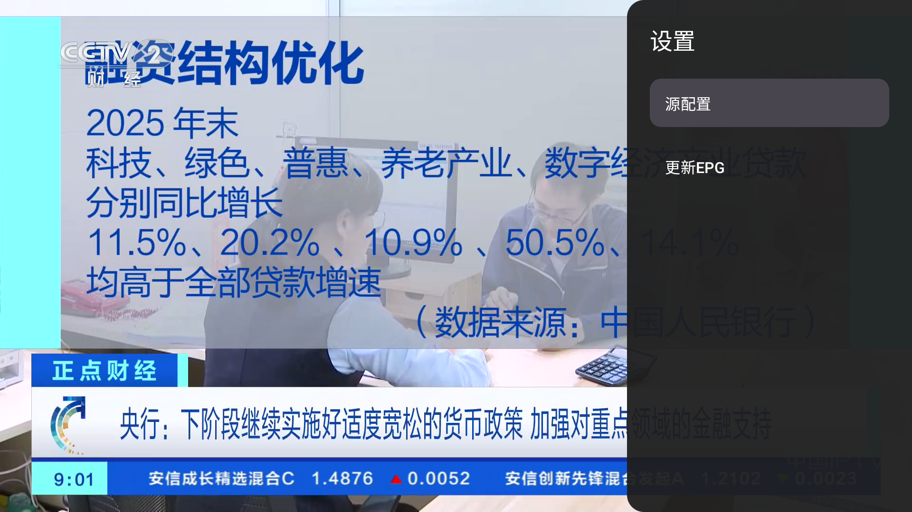
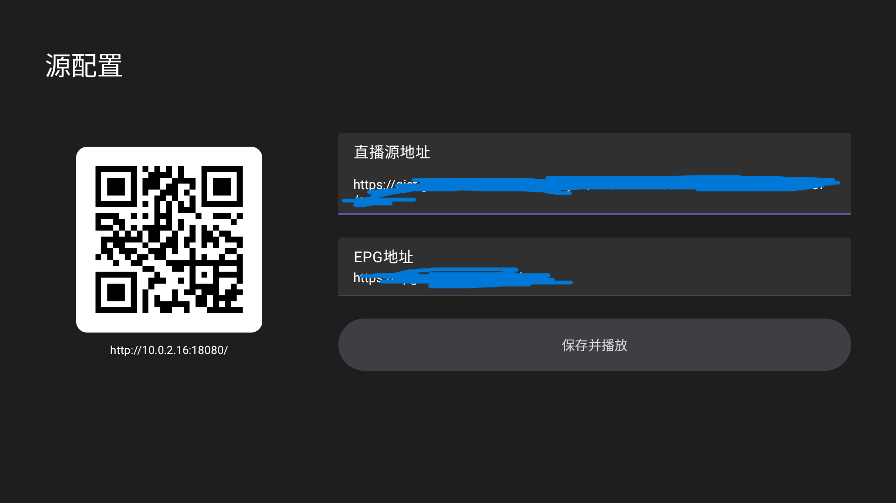
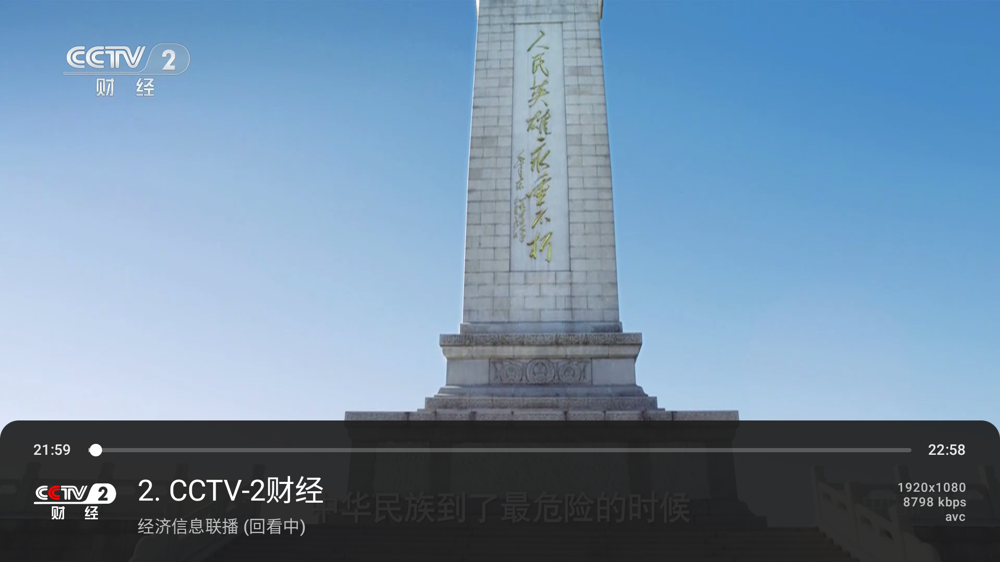
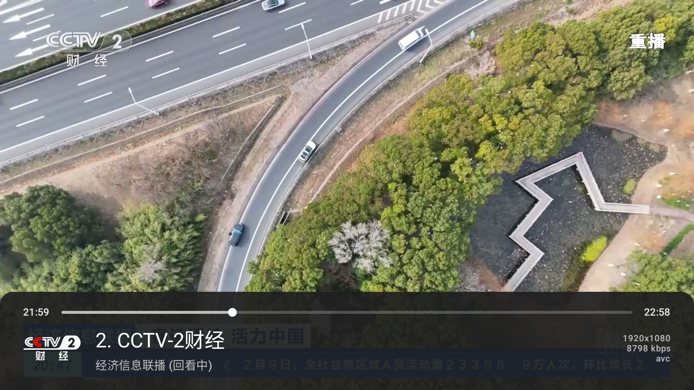

# IPTV（Android TV）

一个深色风格的电视端 IPTV 播放器：加载 `m3u` 直播源，使用 Media3/ExoPlayer 播放频道；可选加载 XMLTV EPG，并在频道列表中展示节目单与回看入口。

## 功能

- 支持通过 URL 加载 `m3u/m3u8` 播放列表
- 频道分组、频道列表与当前节目展示
- EPG（XMLTV）解析与缓存
- 节目单浏览与回看/时移入口（按节目播放）
- 局域网配置：电视端生成二维码/地址，手机浏览器打开后可推送直播源与 EPG 源
- 遥控器友好交互（Compose for TV）

## 技术栈

- UI：Jetpack Compose for TV（`androidx.tv.material3`）
- 播放：Media3 ExoPlayer（含 HLS）
- 网络：OkHttp
- 局域网服务：NanoHTTPD
- 二维码：ZXing

## 使用方式

### 1）首次配置

首次启动进入“源配置”页面：

- 直播源：填写 `m3u` 地址（例如 `http(s)://.../xxx.m3u`）
- EPG 源（可选）：填写 XMLTV 地址（例如 `http(s)://.../epg.xml`）

保存并加载后会进入播放器，并会记住上次播放频道。

### 2）手机推送配置（同一局域网）

在“源配置”页面会启动一个局域网 HTTP 服务并显示：

- 访问地址（形如 `http://<电视IP>:<端口>/`）
- 对应二维码

用手机浏览器打开该地址后，可直接把直播源与 EPG 源推送到电视端（无需遥控器输入长链接）。

### 3）播放器遥控器按键

- `DPAD 上/下`：上/下切换频道
- `DPAD 左`：打开频道/节目抽屉
- `DPAD 右` 或 `MENU`：打开设置抽屉
- `DPAD 中键/Enter`：打开信息条
- `Back`：关闭抽屉/信息条；在回看状态下按两次返回直播；其余情况下按两次退出

## 构建

在项目根目录执行：

```powershell
.\gradlew.bat assembleDebug
```

## 目录结构（简要）

- `app/src/main/java/com/cjlhll/iptv/`：核心逻辑与 UI
  - `MainActivity`：源配置入口（支持局域网推送）
  - `PlayerActivity`：播放器与遥控器交互
  - `M3uParser`、`XmlTvParser`：源解析
  - `EpgRepository`、`EpgCache`：EPG 数据与缓存

## 预览

| | | |
|:---:|:---:|:---:|
|  |  |  |
|  |  |  |
|  |  |  |
